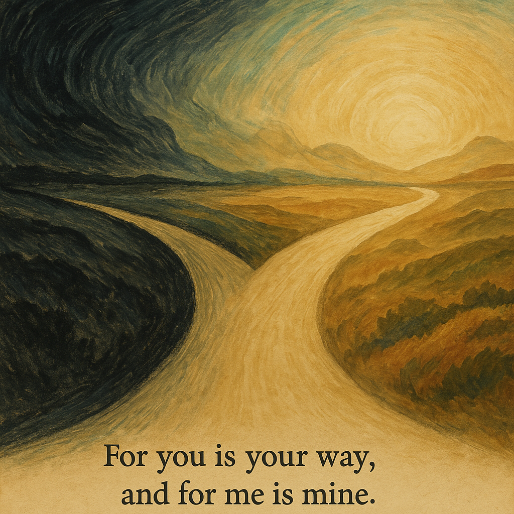
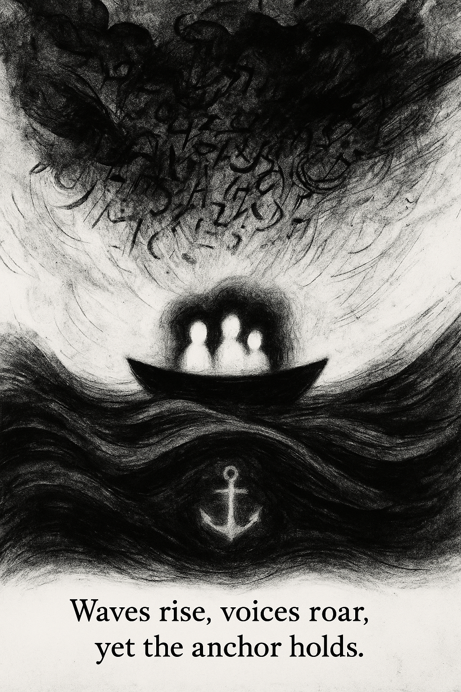
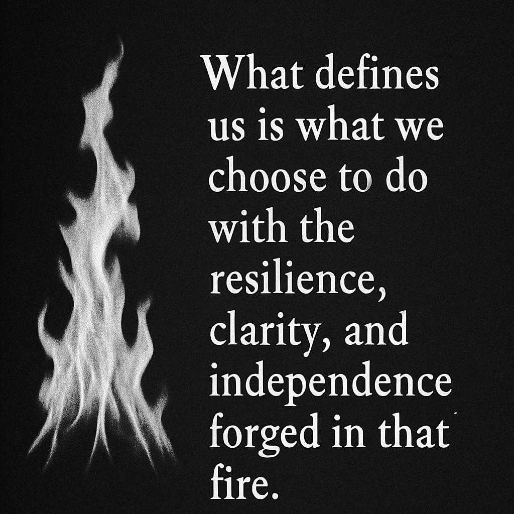
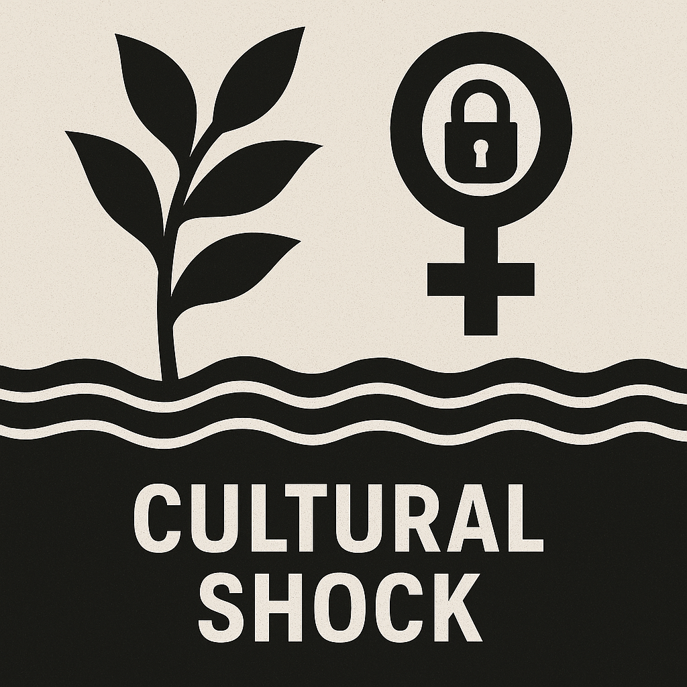
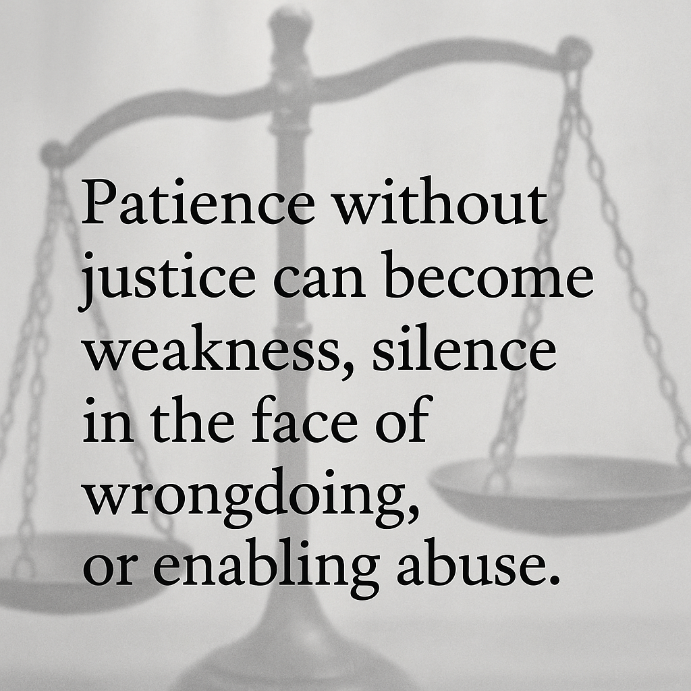
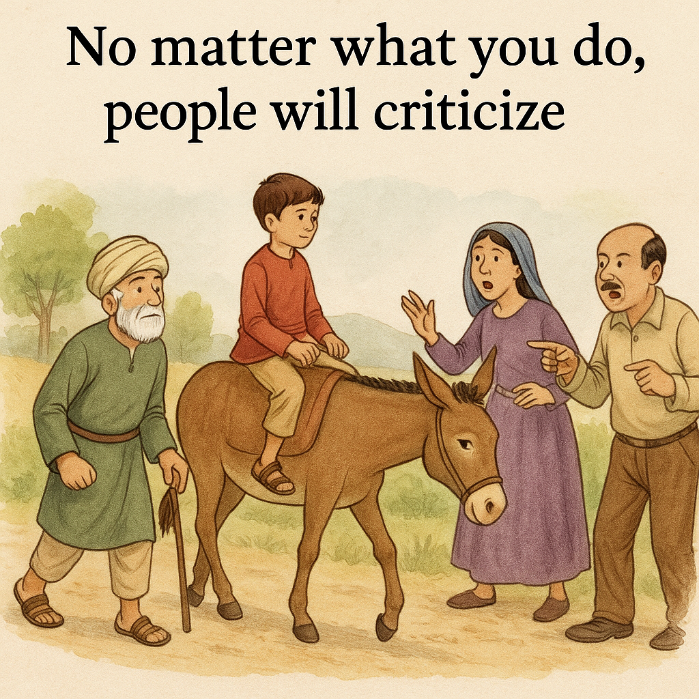
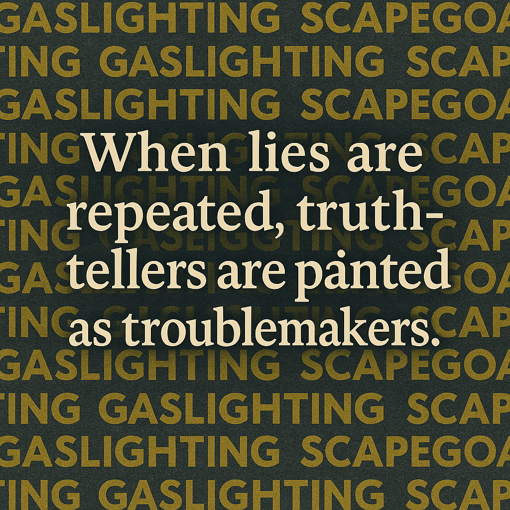
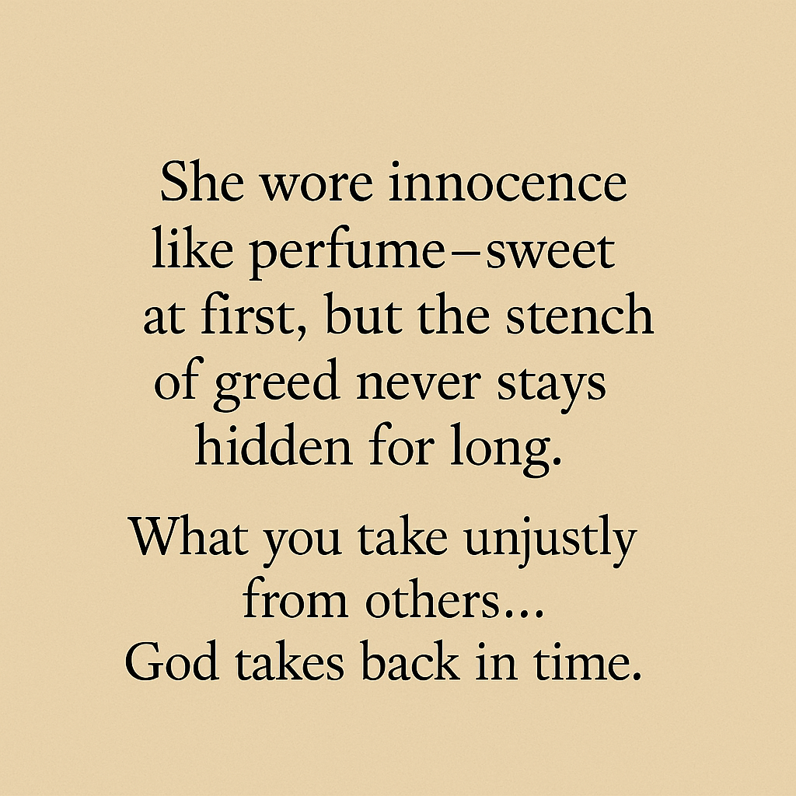

# AI Art Collection – Resilience, Choice, and Truth

This folder contains a small collection of AI-assisted visual pieces combining
symbolism, short written messages, and emotional themes.  
Each image was directed using tools like **ChatGPT** (for concept and wording)
and **DALL·E / AI art tools** (for composition, style, and mood).

The goal of this series is to explore:
- Choice and divergent paths
- Inner resilience during storms
- Identity and growth through cultural pressure
- Justice, criticism, and gaslighting
- Moral clarity and consequences

---

## Gallery

### 1. Two Journeys  
**File:** `ai-art-path-two-journeys.png`  

> *For you is your way, and for me is mine.*

A branching-road landscape where one path leads into darkness and the other
toward light. This piece reflects the idea of letting others walk their path
while choosing one’s own with clarity and calm conviction.

---

### 2. The Anchor Holds  
**File:** `ai-art-anchor-holds.png`  

> *Waves rise, voices roar, yet the anchor holds.*

Three figures in a small boat under a stormy sky, with an anchor below the waves.
This visual represents stability, faith, and inner grounding despite noise,
criticism, or chaos around us.

---

### 3. Forged in Fire  
**File:** `ai-art-forged-in-fire.png`  

> *What defines us is what we choose to do with the resilience, clarity, and
> independence forged in that fire.*

Minimal black-and-white composition with a rising flame. The focus is on how
hard experiences refine strength rather than destroy it.

---

### 4. Cultural Shock – Growth Under Constraint  
**File:** `ai-art-cultural-shock.png`  

A bold graphic pairing a growing plant with a locked female symbol above a wave
pattern. The piece captures tension between growth, identity, and cultural or
social constraints, especially for women.

---

### 5. Patience and Justice  
**File:** `ai-art-patience-and-justice.png`  

> *Patience without justice can become weakness, silence in the face of
> wrongdoing, or enabling abuse.*

A subtle scale-of-justice background with text about the boundary between
healthy patience and harmful silence. Framed as a general ethical reflection.

---

### 6. Criticized Either Way  
**File:** `ai-art-criticism-either-way.png`  

> *No matter what you do, people will criticize.*

An illustrated scene of a family walking with a boy on a donkey, inspired by
traditional moral stories. The message highlights that external judgment is
unavoidable, so choices must align with conscience, not approval.

---

### 7. Gaslighting and Truth-Tellers  
**File:** `ai-art-gaslighting-truthtellers.png`  

> *When lies are repeated, truth-tellers are painted as troublemakers.*

A typographic background repeating words like “gaslighting” and “scapegoat,”
with a central statement about how repeated false narratives can invert
perception of who is causing harm.

---

### 8. Hidden Greed  
**File:** `ai-art-hidden-greed.png`  

> *She wore innocence like perfume—sweet at first, but the stench of greed never
> stays hidden for long. What you take unjustly from others… God takes back in time.*

A text-based piece exploring moral consequences and the contrast between
surface-level innocence and hidden motives. Presented here as a fictional,
literary reflection.

---

## Tools and Process (High-Level)

For this collection I used:

- **ChatGPT** – to refine concepts, wording, and short poetic lines  
- **AI image generation tools** (e.g., DALL·E) – to translate ideas into visual form  
- Iterative prompting – experimenting with composition, symbolism, and tone  
- Basic layout / typography choices to match message and mood

The focus is less on technical rendering and more on **conceptual direction,
message clarity, and storytelling through symbolic visuals**.
