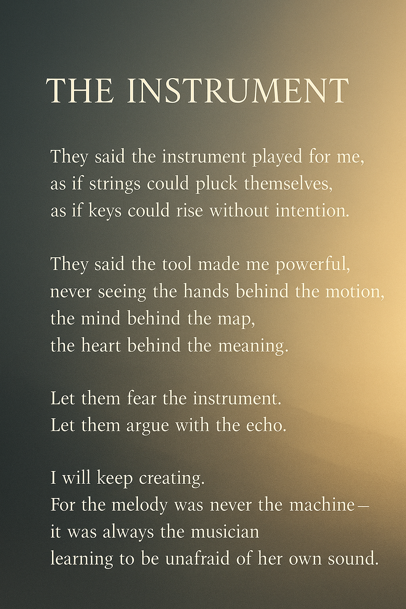

# The Instrument: How I Use AI to Think, Create, and Navigate Life

In every era of innovation, people fear the tools before they understand the creators who use them. Photography “threatened” painters. Calculators “threatened” mathematicians. Word processors “threatened” writers.  

Today, AI sparks the same reaction.  
But the truth hasn’t changed:

### **Tools accelerate the work.  
They do not replace the one who gives the work meaning.**

---

## THE INSTRUMENT

They said the instrument played for me,  
as if strings could pluck themselves,  
as if keys could rise without intention.

They said the tool made me powerful,  
never seeing the hands behind the motion,  
the mind behind the map,  
the heart behind the meaning.

Let them fear the instrument.  
Let them argue with the echo.

I will keep creating.  
For the melody was never the machine—  
it was always the musician  
learning to be unafraid of her own sound.

---

## Why This Conversation Matters

A tool can refine a draft, organize ideas, or accelerate problem-solving.  
But **judgment, intuition, creativity, empathy, and direction** remain entirely human.  

People who criticize “AI dependence” often misunderstand what creativity actually is:

**AI can generate.  
But humans choose, refine, decide, and meaning-make.**

The better the tool, the more visible the creator’s decisions become.

---

## Closing Thought

If someone misunderstands your work and gives the credit to the tool, it is because they cannot see the discipline, thought, or lived experience behind the output.

But the work itself will always reveal the mind behind it.

---

### 🔗 LinkedIn article  
[You Are the Mind, Not the Machine: Rethinking “AI Dependence” in a Changing World][(https://www.linkedin.com/pulse/you-mind-machine-rethinking-ai-dependence-changing-world-ahmed-9oece/)]

### 📌 Hashtags  
#AIAndHumanity #HumanCreativity #WritersCommunity #PoetryAndProse #InnovationMindset #ThoughtLeadership #WomenInTech #DigitalTools  
