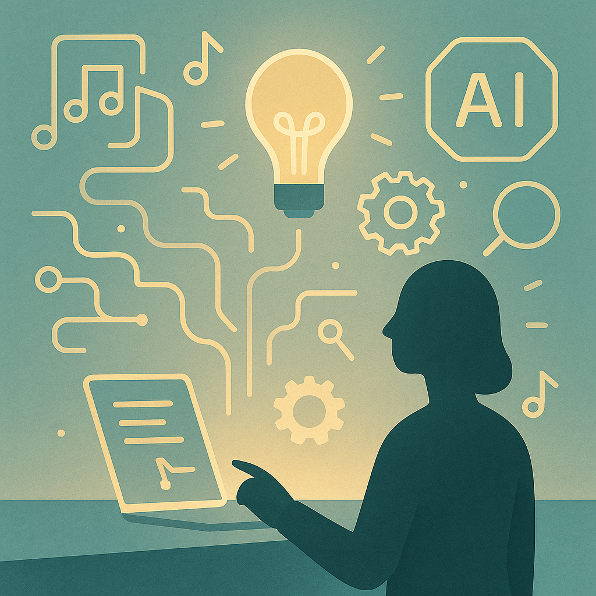

# Embracing AI as a Tool for Creative Empowerment  
**By Maria S. Ahmed, #OPEN_TO_WORK**

Artificial Intelligence is often talked about as a threat — to jobs, creativity, or even human identity.  
But for many of us, AI has become something very different:

✨ **A tool for empowerment**  
✨ **A partner in creativity**  
✨ **A way to turn scattered thoughts into structured ideas**

AI didn’t replace my voice — it amplified it.

---

## Discovering Creativity Through AI  
When life becomes demanding, creativity is often the first thing we lose.  
AI helped me reclaim it.

I began using ChatGPT and visual tools not to “cheat,” but to *express*.  
To put shape to emotions that were once only internal.  
To turn ideas into poetry, visuals, reflection pieces, and long-form writing.

AI became the bridge between:

- thought and articulation  
- emotion and form  
- chaos and structure  

It reminded me that creativity isn’t limited by time, tools, or circumstance — only by access.

---

## AI as a Practical Daily Companion  
Beyond creativity, AI helped simplify real problems:

- Building faster workflows  
- Designing visual concepts  
- Improving technical writing  
- Rapid learning in cybersecurity and data  
- Organizing complex tasks  
- Reducing time spent on repetitive work  

Instead of working *harder*, AI allowed me to work *smarter* — and with clarity.

---

## What AI Cannot Replace  
AI supports creativity, but it can never replace:

- lived experience  
- emotional insight  
- intuition  
- personal resilience  
- cultural lenses  
- human moral judgment  

The ideas, emotions, and direction still come from *us*.  
AI simply helps carry the weight.

---

## The Empowerment Mindset  
Using AI effectively isn’t about depending on it —  
It’s about **partnering** with it.

It is the modern equivalent of:

- using calculators in math  
- using Photoshop in design  
- using IDEs in programming  
- using cameras in art  

AI doesn’t diminish creativity — it *extends* it.

---

## Final Reflection  
AI is not the future.  
It is the *present*, and it is accessible.

And for many of us — especially women, caregivers, creatives, career-break professionals, and quiet thinkers —  
AI opens doors that were previously locked.

It levels the playing field.  
It gives voice to the unheard.  
It accelerates the dreams of those who never had the time, tools, or support.

AI didn’t replace my creativity.  
It unlocked it.

---

### 📎 Original LinkedIn Article  
https://www.linkedin.com/pulse/embracing-ai-tool-creative-empowerment-maria-s-ahmed-v8dqe/

### 🏷 Tags  
#AIEmpowerment · #CreativeTech · #Innovation · #AIForGood · #WomenInTech  
