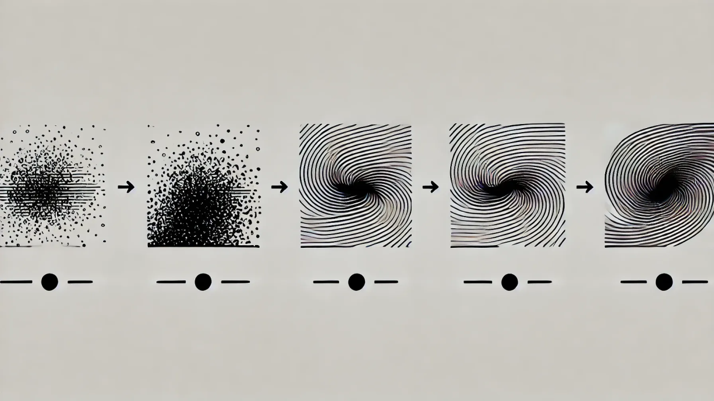

# Quality Over Quantity: A Reflection on Decluttering Our Lives and Relationships  
**By Maria S. Ahmed**

Minimalism has become a modern movement — not just a trend but a mindset.  
Many of us have spent years decluttering our homes, choosing **quality over quantity**, and removing possessions that no longer hold value. We do it to create space, order, and peace.

But rarely do we apply the same principle to something far more impactful:

## **Our relationships.**

---

## 🧩 Rethinking What “Quality” Means  
We carefully choose:

- quality products  
- better routines  
- meaningful habits  

Yet many of us never pause to ask:

**“Are the people in my life adding value — or adding clutter?”**

Just like we question:

- health advice from someone who doesn’t practice it  
- financial advice from someone drowning in debt  
- career advice from someone who has never built one  

—we should be equally discerning about emotional and social influences.

---

## 🧠 Emotional Decluttering  
Toxic, draining, or manipulative people can clutter the mind the same way objects clutter a room.

Some examples:

- constant criticism  
- gaslighting  
- jealousy masked as “concern”  
- people who watch but never support  
- connections rooted in competition, not care  

These take up space that should belong to peace, growth, and genuine connection.

---

## 🌱 Choose What Nourishes You  
Just as we keep items that are:

- useful  
- beautiful  
- meaningful  

—we should keep people who:

- support honestly  
- celebrate our wins  
- offer empathy, not envy  
- contribute to our emotional well-being  

And we should distance ourselves from those who are merely… **noise**.

---

## 🏠 Decluttering Isn’t Just Physical  
Minimalism is not only a lifestyle — it is a boundary.

By curating our relationships with the same clarity we use to curate our homes, we create a life that feels:

- lighter  
- healthier  
- more intentional  
- more aligned with who we truly are  

Decluttering is not just for closets and drawers.  
Sometimes, it’s for people.

---

## 🔗 **Read on LinkedIn**  
**Quality Over Quantity: A Reflection on Decluttering Our Lives and Relationships**  
https://www.linkedin.com/pulse/quality-over-quantity-reflection-decluttering-our-lives-ahmed-ju90e/
