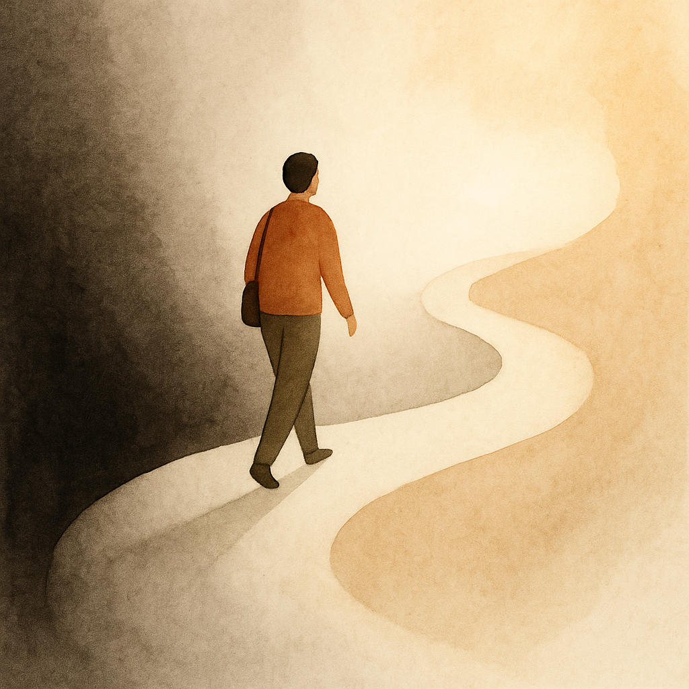

# Embracing Resilience: Finding Joy and Innovation Through Adversity  
**By Maria S. Ahmed**

Life isn’t linear. It twists, dips, pauses, and tests us in ways we rarely expect. We do our best to balance work, family, studies, and responsibilities—but sometimes life interrupts the routine. A loss, a setback, or a sudden shift can shake the ground beneath us.

Yet in these moments, something powerful often emerges:

## **Resilience.**

Recently, a TED Talk reminded me that adversity doesn’t end our progress—it reshapes it. Sometimes it slows us down, but often it redirects us toward growth we wouldn’t have found otherwise.

---

## Creativity and Innovation Through Challenge  
One discovery that surprised me was the role of **creative expression**—especially writing—in rebuilding momentum. Even in difficult seasons, writing helped me clear my mind, reestablish focus, and reconnect with purpose.

And unexpectedly, **AI became part of that journey**.

AI tools helped me turn everyday tasks into something more efficient—even enjoyable. My mother used to say to make chores fun by adding music. Now, I pair creativity with AI to streamline work, organize thoughts, and break monotony—like transforming image capture into fast, error-free data entry.

Small improvements, but powerful ones.

---

## Returning to Strength  
Staying motivated during hard times is never easy. It’s human to feel overwhelmed or discouraged. But resilience isn’t about avoiding difficulty—it’s about returning to yourself, one small step at a time.

As we move through life, may we find joy in ordinary moments, creativity in unexpected places, and strength in the parts of us shaped by challenge—not broken by it.

---

## 🔗 **Read on LinkedIn**  
**Embracing Resilience: Finding Joy and Innovation Through Adversity**  
https://www.linkedin.com/pulse/embracing-resilience-finding-joy-innovation-through-adversity-ahmed-g87xe/
