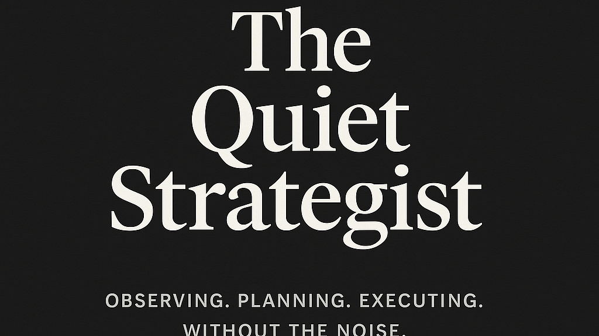

# The Quiet Strategist: What Assessments Got Wrong — And What Real Life Got Right
**By Maria S. Ahmed**

  

---

## Introduction
Let’s clear something up:

I haven’t been *waiting* for the right role to find me.  
I’ve been working — just not in ways hiring systems know how to measure.

An online assessment tried to define me.  
It failed.

Here’s what it said — and what it missed:

---

## What the Assessment Claimed (and What It Overlooked)

### 🤫 Introverted?  
I’m observant. I speak when it matters and move with intention.  
I don’t waste energy on performative leadership.

### 🧱 Accommodating?  
I pick my battles.  
I step back when it serves a purpose — and step up when it counts.

### ⏱ Impatient?  
I act quickly on inefficiencies because I value outcomes, not excuses.

### 💥 Motivated?  
Absolutely.  
I’ve managed motherhood, high-stakes projects, career pivots, and toxic dynamics — all while staying focused and driven.

---

## What I’ve Been Doing While “Unemployed”
- Shut down contractors trying to exploit “naïve homeowner” stereotypes  
- Outsmarted scare tactics disguised as “professional advice”  
- Managed a home renovation like a high-stakes project — with clarity, control, and zero compromise  
- Protected my time, my budget, and my peace  
- Acted as my own project manager, negotiator, and analyst across multiple domains  

These are not small tasks.  
They require intelligence, discipline, emotional control, and strategic thinking.

---

## The Duality People Miss
I’m vocal and bold in my personal life.  
In professional settings, I lead with quiet confidence, strategy, and intent.

That duality confuses people who expect women — especially women of color —  
to either shrink or explode.

I do neither.

I observe.  
I plan.  
And when I move, it’s with purpose.

---

## What These Months Have Taught Me About Hiring
- Online assessments don’t capture nuance  
- “Cultural fit” often means “predictable personality”  
- Calm thinkers get overlooked for loud personalities  
- Strategic restraint is mistaken for indecision  
- Quiet confidence is mistaken for lack of capability  

But let me be clear:

🚫 I don’t need to “look” like a leader to be one.  
✅ I don’t need to shout to be effective.  
🧩 And I don’t need to match your mold to fit the mission.

---

## If You're Hiring Someone Who:
- Protects people, processes, and property as if they own it  
- Makes smart decisions under pressure  
- Moves with calm clarity, not chaos  
- Sees what others miss — and acts on it with quiet precision  

I’ve already been doing the job.  
You just haven’t seen the title yet.

---

### 🏷 Tags  
#TheQuietStrategist #AuthenticLeadership #MisunderstoodButCapable #OpenToWork  
#CareerBreak #NotNaive #UnseenStrength #CalmIsPower #UnderratedNotUnderqualified  

